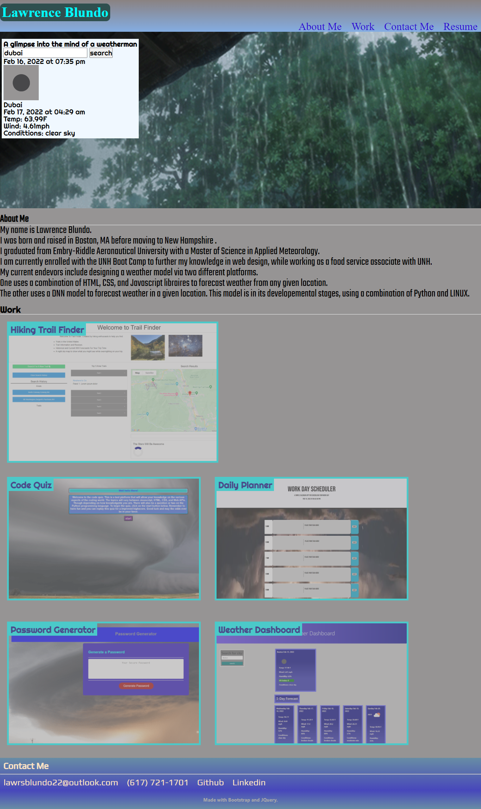

# Analysis-of-A-Weatherman

Welcome, greetings, and hello!

This is my portfolio page. It will contain elements of the following in its design:

>1. HTML (semantic backbone)
>2. CSS (Front-End Design)
>3. Javascript (Im going to go into detail in a few minutes)
>4. API retrieval (Incorporates api from [Openweathermap](https://openweathermap.org))

Developer's note: The HTML and CSS will have dynamically updated features to it.

This website is going to be a remake of a previous portfolio that I had created. The previous iteration only contained a semantic HTML with CSS styling incoporated into the design. There are only placeholders located in the Work section, and the formating for different screen sizes is.....in the works to put it bluntly. I have made the decsion to redo the website so that the UI is more engaging for the user and the applications made so far are displayed with links to the deployed site included.

================================================================================

## USER STORY
```
AS AN employer
I WANT to view a potential employee's deployed portfolio of work samples
SO THAT I can review samples of their work assess whether they are a good canidate for an open position
```

================================================================================

## ACCEPTANCE CRITERIA

```
GIVEN I need to sample a potential employee's previous work
WHEN I load their portfolio
THEN I am presented with the following
    >1. The developer's name 
    >2. A recent photo or avatar
    >3. Links to the About Me, Work, and Contact Info sections
WHEN I click on one of these links in the navigation
THEN The UI scrolls to the corresponding section
WHEN I click on the link to the section about their work
THEN The UI scrolls to a section with titled images of the developer's applications
WHEN I am presented with the developer's first application
THEN THAT application's image should be larger in size than the others
WHEN I click on the images of the applications
THEN I am taken to that deployed application
WHEN I resize the page or view the site on various screens and devices
THEN I am presented with a responsive layout that adapts to my viewport
```
================================================================================

## Previous accomplishments

So the previous iteration had most of its UI elements match what the acceptance criteria asks with two exceptions:

>1. The user is taken to the deployed appilcation when they click on the image. At the time, there were no deployed applications to be displayed. To compensate, placeholder images were used to fill in the blanks

>2. Honestly.....I did struggle with the adaptive quality for viewing the page on different screen sizes. I am still a little hesitant to deal with this aspect, though there are now multiple tools that can be used to reduce the level of difficulty.

For a look at the previous portfolio site [Click Here](http://lawrencesb24.github.io/Weatherman-Portfolio/)

=======================================================================================

## Gameplan for remake version

This iteration will include the following aspects:

>1. Javascript (vanilla to start with though I am going to brush up on JQuery)
>2. Moment.js (JS library to add in dynamic time variables to header section)
>3. Bootstrap/Foundation (These will handle more advanced UI aspects of the page)
>4. API Fetching (I am thinking about using a weather feature based on the user's location)

=======================================================================================

## Portfollio Page Description

The site contains the following sections: 

>1. About ME: A brief description about the developer. This includes their background and what they currently do for a living

>2. Work: This is pretty self-explanitory. This section contains the highlighted applications the developer has created to show to the employer

>3. Contact Me: This section contains the contact information for the employer to reach back with the potential canidate in the future

=======================================================================================

#### Link to the new iteration: [Click Here](https://lawrencesb24.github.io/Analysis-of-A-Weatherman/)

